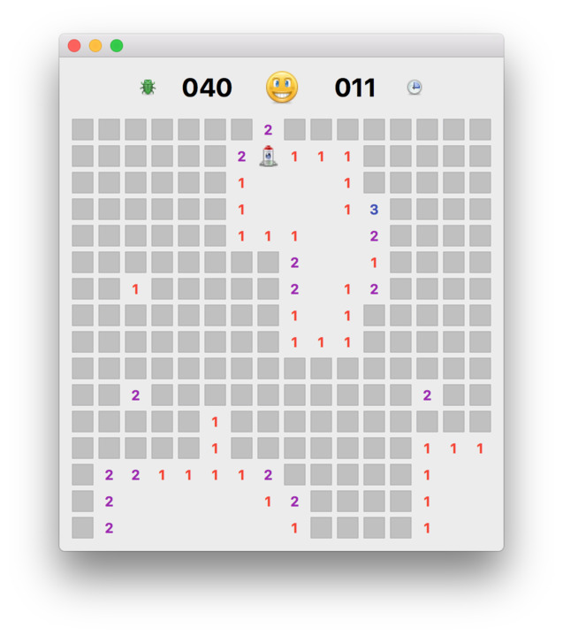
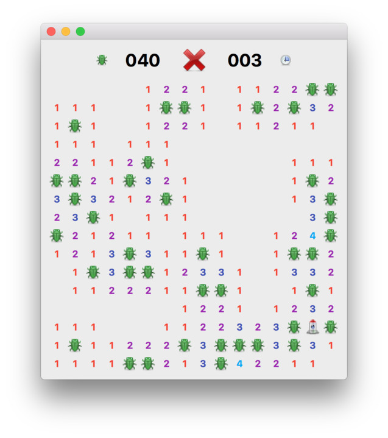

# Bug Buster

> This project has been cloned from [pythonguis-examples](https://github.com/pythonguis/pythonguis-examples).

## Set up 
Make sure you have [Python](https://www.python.org/downloads/) installed.

### In Visual Studio Code
- Clone the repository
- Open the repository folder in Visual Studio Code
- Make sure you have the [Python extension](https://marketplace.visualstudio.com/items?itemName=ms-python.python) installed
- Open the Command Palette (View > Command Palette...) and run the command: "Python: Create Environment"
- Select the `venv` and the `requirements.txt` file to install the dependencies
- Now open the `main.py` file and click on the top-right play button to run the game! Or run the "Python: Run Python File in Terminal" command from the Command Palette.

### In a terminal
- Clone the repository
- In a terminal, navigate to the repository:
```cd /path/to/moonsweeper```
- Create a virtual environment:
```python -m venv venv``` 
> Note: You may need to use `python3` or `py` instead of `python` depending on your system.
- Activate the virtual environment:
  - On Windows:
  ```venv\Scripts\activate```
  - On macOS and Linux:
  ```source venv/bin/activate```
- Install the dependencies:
```pip install -r requirements.txt```
- Run the game:
```python main.py```


## About the game 

Bug Buster is a single-player puzzle video game. The objective of the game is to explore the area around your landed space rocket, without coming too close to the deadly Bug aliens. Your trusty tricounter will tell you the number of B'ugs in the vicinity.






> If you want to learn more about build GUI applications with Python,
take a look at my [PyQt5 tutorials](https://www.pythonguis.com)
which covers everything you need to know to start building your own applications with PyQt5.


## Other licenses

Icons used in the application are by [Yusuke Kamiyaman](http://p.yusukekamiyamane.com/).
